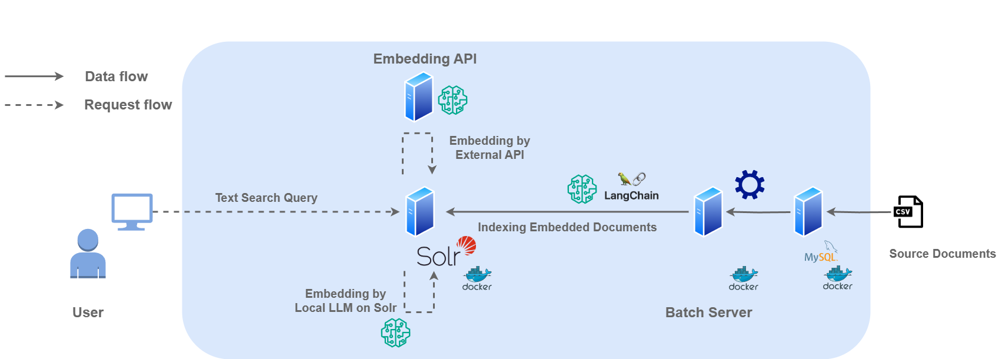

# Solr Text to Vector Sample

## System Architecture



## Environment

### OS

The following environments have been confirmed to work.

```bash
$ cat /etc/lsb-release
DISTRIB_ID=Ubuntu
DISTRIB_RELEASE=20.04
DISTRIB_CODENAME=focal
DISTRIB_DESCRIPTION="Ubuntu 20.04.6 LTS"
```

### Machine Spec

|      | Size |
| :--- | :--- |
| RAM  | 16GB |
| VRAM | 8GB  |

### Tools

|                | Version  |
| :------------- | :------- |
| Docker         | 20.10.21 |
| docker-compose | 1.29.2   |
| wget           | 1.20.3   |

## Usage

```bash
# initial
$ make all
# index already exists
$ make launch
```

Access http://localhost:8501 by any Browser.

## Query-Time Embedding

Solr 9.9.0からは、クエリ時にもテキストから埋め込みベクトルを生成できるようになりました。

### 設定

1. モデル設定ファイル（`solr/myModel.json`）を作成し、使用する埋め込みモデルを指定
2. スキーマに `knn_text_to_vector` フィールドタイプを定義
3. サービス起動後、Makefileの `model-update` ターゲットでモデルをSolrに登録

```bash
# Solr起動後に実行
$ make model-update
```

### 使用方法

クエリ時埋め込みを使用するには、`{!knn_text_to_vector}` クエリパーサーを使用します：

```bash
# クエリテキストを埋め込みベクトルに変換して検索
curl "http://localhost:8983/solr/idcc/select?q={!knn_text_to_vector f=vector_query topK=10}検索したいテキスト"
```

従来のインデックス時の埋め込み（`vector`フィールド）と併用することで、柔軟なベクトル検索が可能です。

## Related Documents

- [Solr のベクトル検索がちょっとだけ楽になったらしい](https://zenn.dev/sashimimochi/articles/35a54fa62d32aa)
- [Apache Solr 9.9.0 Changes](https://solr.apache.org/docs/9_9_0/changes/Changes.html)
- [Dense Vector Search Guide](https://solr.apache.org/guide/solr/latest/query-guide/dense-vector-search.html)
